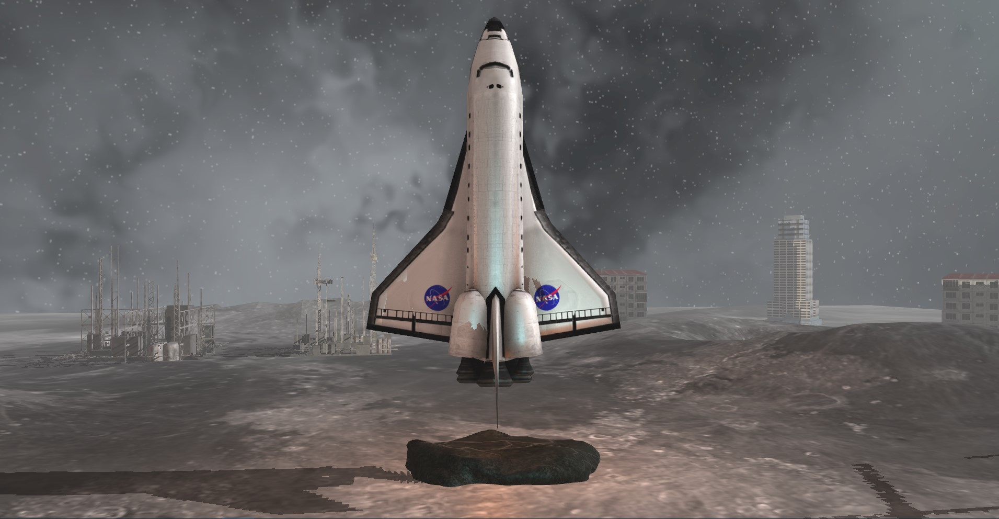
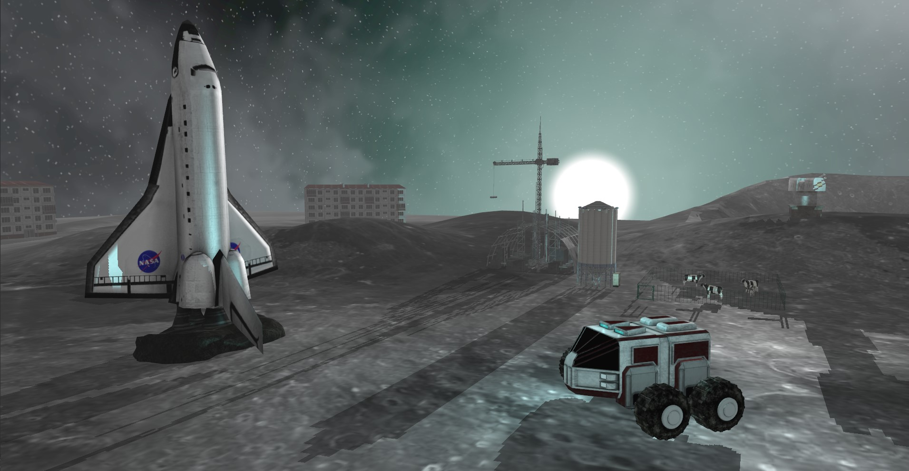

# GraphicProcessing-OpenGL

The models were edited in Blender. 

## Functionalities:
 - Scene visualization using the keyboard and mouse;  
 - Scene visualization in solid and wireframe modes;  
 - Increasing or decreasing the fog density;  
 - Option to rotate the light (day-night effect).

## Observations:  
- The models and textures have not been uploaded to GitHub.

